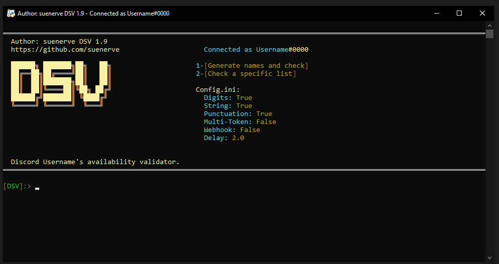

# Discord Username Checker

just a tool to check and claim discord usernames

---
- check specific lists of usernames
- generate random usernames and check them
- multi-token support with auto rotation
- webhook notifications
- schedule username claims for exact times
- proxy scraping and rotation
- customizable config
  
 > Check <a href =#notes >notes</a> for a very important information before using this tool, and for some FAQ. And BEFORE opening an issue.

# how to use
- install python
- install dependencies: `pip install -r requirements.txt`
- add your token and password to `config.ini`
- run `python3 dsv.py`

## scheduled claiming
- option 3 lets you schedule a username claim for a specific time
- format: `YYYY-MM-DD HH:MM:SS`
- needs your password in config

## proxies
- enable `USE_PROXIES = true` in config
- auto-scrapes proxies if `proxies.txt` doesn't exist
- or add your own proxies to `proxies.txt`

## multi-token
- enable `MULTI_TOKEN = true` in config
- add tokens to `tokens.txt`
- auto-rotates when rate limited 

> - For adding a specific list of usernames, create a file named `usernames.txt` in the same running directory as `dsv.py` and list your usernames there, separating them by a new line.
> - For adding multiple tokens, open `config.ini` and enable `MULTI-TOKEN` by making it `true` and paste your tokens inside `tokens.txt` separating them by a new line.

# Images

# Notes
#### Disclaimer: I'm not responsible for/of any damage/results/returns/suspension made/resulted with/by this tool. It is your will to run, and once ran, it's your responsibility.

> - This repository is licensed under a **NON-COMMERCIAL USE.** <a href="https://github.com/suenerve/Discord-Username-Checker/blob/main/LICENSE">READ here.</a>

- I **demand** my credits to the code wherever it's used.
- Spamming Discord's API is against TOS, You may get your account suspended/rate limited and I am not responsible.
- You need to get your Discord's account's authorization token and paste it inside the variable: `TOKEN` . On how to do that check these following steps: https://www.androidauthority.com/get-discord-token-3149920/
- Make sure to have a decent delay or you may get your account disabled. 

